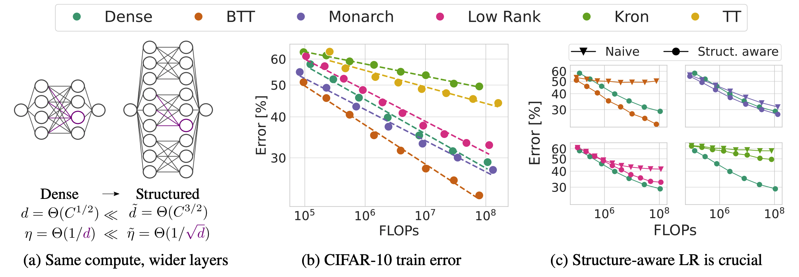

# Compute Better Spent: Replacing Dense Layers with Structured Matrices
This repository contains the code for the paper [Compute Better Spent: Replacing Dense Layers with Structured Matrices](https://arxiv.org/abs/2406.06248) by Shikai Qiu, Andres Potapczynski, Marc Finzi, Micah Goldblum, and Andrew Gordon Wilson.

<figure>
  
</figure>

Dense linear layers are the dominant computational bottleneck in foundation models. Identifying more efficient alternatives to dense matrices has enormous potential for building more compute-efficient models, as exemplified by the success of convolutional networks in the image domain.
In this work, we systematically explore structured matrices as replacements for dense matrices. We show that different structures often require drastically different initialization scales and learning rates, which are crucial to performance, especially as models scale. Using insights from the Maximal Update Parameterization, we determine the optimal scaling for initialization and learning rates of these unconventional layers.
Finally, we measure the scaling laws of different structures to compare how quickly their performance improves with compute. We propose a novel matrix family containing Monarch matrices, the Block Tensor-Train (BTT), which we show performs better than dense matrices for the same compute on multiple tasks. On CIFAR-10/100 with augmentation, BTT achieves exponentially lower training loss than dense when training MLPs and ViTs. BTT matches dense ViT-S/32 performance on ImageNet-1k with 3.8 times less compute and is more efficient than dense for training small GPT-2 language models.

Please cite this work as:
```bibtex
@article{qiu2024compute,
    title={{Compute Better Spent: Replacing Dense Layers with Structured Matrices}},
    author={Shikai Qiu, Andres Potapczynski, Marc Finzi, Micah Goldblum, and Andrew Gordon Wilson},
    journal={International Conference on Machine Learning (ICML)},
    year={2024}
}
```

## Setup
To setup the environment, simply run
```
source setup.sh
```
This script installs two conda environments named `struct` and `gpt`. Use the `struct` for CIFAR-10/100 and ImageNet experiments, and `gpt` for GPT-2 experiments. `struct` has more complex dependencies and will take a while to install.

The basic GPT-2 training code and model definition is adapted from [nanoGPT](https://github.com/karpathy/nanoGPT/tree/master).
The directories `timm` and `scaling_mlps` are forked from the repos [pytorch-image-models](https://github.com/huggingface/pytorch-image-models/tree/main) and [scaling_mlps](https://github.com/gregorbachmann/scaling_mlps/tree/main) respectively.

## Datasets
### CIFAR-10/100
```
conda activate struct
python scaling_mlps/data_utils/dataset_to_beton.py --dataset_name cifar10 --mode train --res 32
python scaling_mlps/data_utils/dataset_to_beton.py --dataset_name cifar10 --mode val --res 32
python scaling_mlps/data_utils/dataset_to_beton.py --dataset_name cifar100 --mode train --res 32
python scaling_mlps/data_utils/dataset_to_beton.py --dataset_name cifar100 --mode val --res 32
```

### ImageNet
Download and extract the ImageNet dataset from [here](https://www.image-net.org/download.php).

### OpenWebText
```
conda activate gpt
python prepare_owt.py
```

## Experiments
### Structure-Aware Learning Rate
Run the following scripts and then run `notebooks/struct_aware_lr.ipynb` to make the figures.
#### Figure 2a
```
sh experiments/check_dh.sh
```
#### Figure 2b
```
sh experiments/lr_landscape.sh
```
Then run `notebooks/struct_aware_lr.ipynb` to reproduce the figure.
### CIFAR-10/100
```
sh experiments/mlp.sh
sh experiments/vit.sh
```
Visualize the scaling laws by running `notebooks/scaling_laws.ipynb`.

### ImageNet
```
sh experiments/imagenet.sh
```

### GPT-2
```
sh experiments/gpt.sh
```
